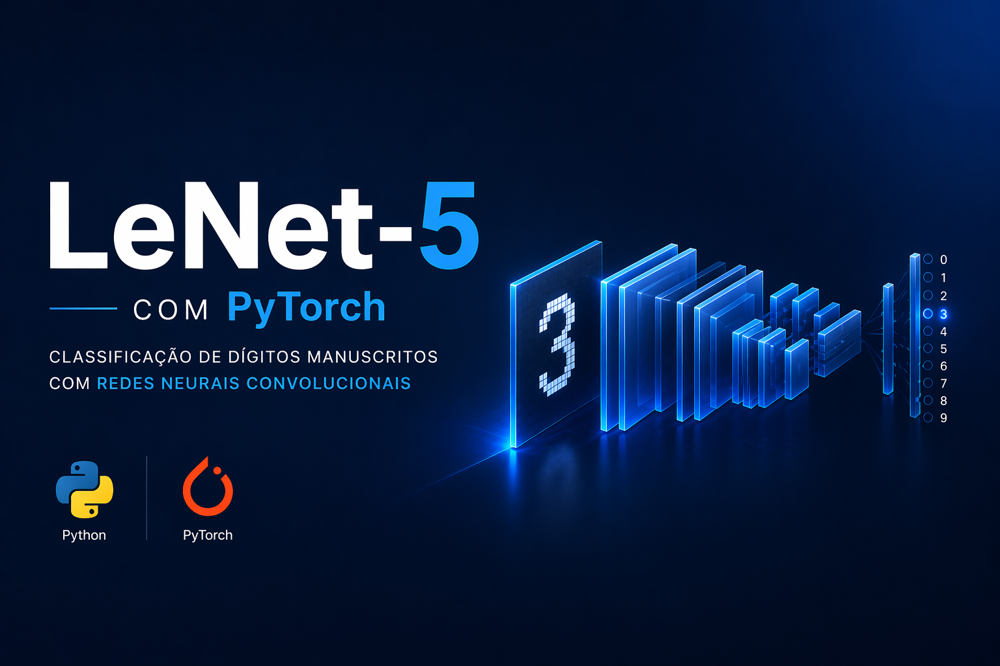

# 🧠 LeNet-5 com PyTorch

Implementação da arquitetura clássica **LeNet-5** utilizando **PyTorch**, aplicada ao dataset **MNIST** para classificação de dígitos manuscritos.

---

<p align="center">
  
</p>


## 🚀 Tecnologias

Este projeto foi desenvolvido com:

- Python
- PyTorch
- NumPy
- Matplotlib (opcional para visualização)
- Jupyter Notebook
- Git e GitHub

---

## 📌 Projeto

Este projeto tem como objetivo implementar do zero a arquitetura **LeNet-5**, uma das primeiras redes neurais convolucionais da história, proposta por Yann LeCun.

A rede foi aplicada no dataset **MNIST**, sendo capaz de reconhecer dígitos manuscritos com alta precisão.

### 🔍 O que foi desenvolvido:

- Estrutura completa da LeNet-5:
  - Camadas convolucionais
  - Camadas de pooling
  - Camadas totalmente conectadas (Fully Connected)
- Funções de ativação
- Processo de treinamento
- Avaliação do modelo
- Salvamento dos pesos (`.pth`)

---

## 🏗️ Arquitetura

A LeNet-5 é composta por:

- **Conv1** → 1 canal → 6 feature maps (kernel 5x5)
- **Pooling**
- **Conv2** → 6 → 16 feature maps (kernel 5x5)
- **Pooling**
- **Flatten**
- **FC1** → 120 neurônios
- **FC2** → 84 neurônios
- **Output** → 10 classes (dígitos 0–9)

---

## 📊 Dataset

- **MNIST**
- 70.000 imagens de dígitos manuscritos
- Imagens em escala de cinza (28x28)

---

## ⚙️ Como executar

```bash
# Clone o repositório
git clone https://github.com/Borlenghi-KB/lenet5-pytorch-mnist

# Acesse a pasta
cd lenet5-pytorch-mnist

# Instale as dependências
pip install torch torchvision

# Execute o notebook

<p align="center">
  Feito por <strong>Kaique Borlenghi</strong>
</p>
